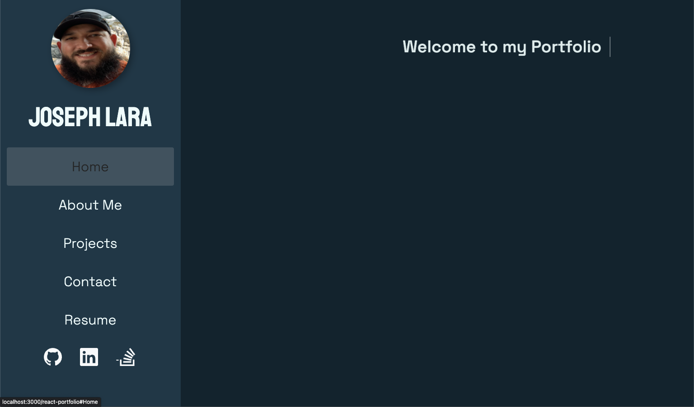

# react-portfolio

## Description

This Portfolio is built with React Library, designed to highlight my past projects as a full stack developers. Portfolio includes all of my professional information and links to some of my project works.

## Table of Contents

- [Description](#Description)
- [Installation](#Installation)
- [Usage](#Usage)
- [Tests](#tests)
- [Contributing](#Contributing)
- [Questions](#Questions)
- [License](#License)

## Installation

No installation required

## Usage

The React Portfolio application is currently deployed with [GitHub Pages](https://jlara65.github.io/react-portfolio/)

- Screenshot of Portfolio's homepage
  

## Questions

If you have any question or would like to report the issues in this project, please feel free to contact me at email_to_be_annouced@domain.com

## License

This project is license under the [MIT](./LICENSE)

&copy; 2022 Joseph Lara
